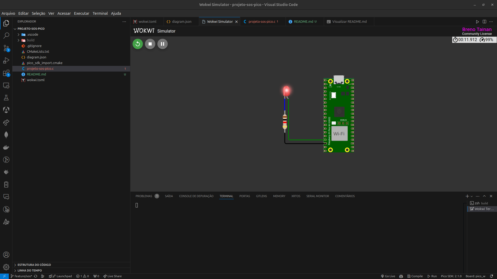

**Projeto SOS**

**Objetivo:** Transmitir o sinal SOS em código Morse utilizando um LED externo conectado ao GPIO do microcontrolador Raspberry Pi Pico W.

### **Introdução**

O objetivo do projeto é implementar, utilizando a linguagem C, o padrão de código Morse para o sinal SOS com um LED conectado à placa Raspberry Pi Pico W. A solução foi desenvolvida e testada no ambiente de simulação Wokwi, integrado ao Visual Studio Code.

Os principais pontos implementados incluem:

- Simulação do circuito eletrônico com LED e resistor.
- Configuração do GPIO para controlar o LED.
- Modularização do código com funções separadas para pontos, traços e sequência SOS.
- Ciclo contínuo do padrão SOS, incluindo os intervalos especificados.

### **Descrição do Circuito**

O circuito foi montado no simulador Wokwi e inclui:

1. Um LED conectado ao GPIO 13 do Raspberry Pi Pico W.
2. Um resistor de 1kΩ em série com o LED para limitar a corrente.
3. Conexão do cátodo do LED ao GND da placa.

**Arquivo JSON para configuração no Wokwi**:

```json
{
  "version": 1,
  "author": "Breno Tainan",
  "editor": "wokwi",
  "parts": [
    {
      "type": "board-pi-pico-w",
      "id": "pico",
      "top": -80.05,
      "left": 13.15,
      "attrs": { "builder": "pico-sdk" }
    },
    {
      "type": "wokwi-led",
      "id": "led1",
      "top": -61.2,
      "left": -101.8,
      "attrs": { "color": "Red" }
    },
    {
      "type": "wokwi-resistor",
      "id": "r1",
      "top": 33.6,
      "left": -115.75,
      "rotate": 90,
      "attrs": { "value": "1000" }
    }
  ],
  "connections": [
    [ "led1:C", "r1:1", "blue", [ "v0" ] ],
    [ "pico:GND.4", "r1:2", "black", [ "h0" ] ],
    [ "pico:GP13", "led1:A", "green", [ "h0" ] ]
  ],
  "dependencies": {}
}
```

### **Código Implementado**

O programa foi modularizado em três funções principais: `enviar_ponto`, `enviar_traco` e `enviar_sos`.

```c
#include "pico/stdlib.h"

// Configurações
#define LED_PIN 13          // Pino GPIO conectado ao LED
#define TEMPO_PONTO 200     // Duração de um ponto (em ms)
#define TEMPO_TRACO 800     // Duração de um traço (em ms)
#define INTERVALO_GAP 125   // Intervalo entre pontos e traços (em ms)
#define INTERVALO_LETRA 250 // Intervalo entre letras (em ms)
#define INTERVALO_CICLO 3000 // Intervalo entre ciclos SOS (em ms)

// Função para enviar um ponto
void enviar_ponto() {
    gpio_put(LED_PIN, true);
    sleep_ms(TEMPO_PONTO);
    gpio_put(LED_PIN, false);
    sleep_ms(INTERVALO_GAP);
}

// Função para enviar um traço
void enviar_traco() {
    gpio_put(LED_PIN, true);
    sleep_ms(TEMPO_TRACO);
    gpio_put(LED_PIN, false);
    sleep_ms(INTERVALO_GAP);
}

// Função para enviar o padrão SOS
void enviar_sos() {
    // Enviar três pontos
    for (int i = 0; i < 3; i++) {
        enviar_ponto();
    }
    sleep_ms(INTERVALO_LETRA);

    // Enviar três traços
    for (int i = 0; i < 3; i++) {
        enviar_traco();
    }
    sleep_ms(INTERVALO_LETRA);

    // Enviar três pontos novamente
    for (int i = 0; i < 3; i++) {
        enviar_ponto();
    }
    sleep_ms(INTERVALO_CICLO);
}

int main() {
    // Configurar o GPIO
    gpio_init(LED_PIN);
    gpio_set_dir(LED_PIN, GPIO_OUT);

    // Loop infinito para enviar o sinal SOS continuamente
    while (true) {
        enviar_sos();
    }
}
```

### **Resultados e Demonstrações**

### **Simulação no Wokwi**

Além do código e circuito descritos, o projeto foi configurado e está disponível para simulação direta no Wokwi. Acesse o projeto através do link abaixo para visualizar e interagir com a execução do padrão SOS em tempo real:

[Projeto no Wokwi](https://wokwi.com/projects/419575747494407169)

### **Captura de Tela**

1. **Execução do Código**



*(Figura 1: LED transmitindo o sinal SOS no simulador)*

### **Vídeo de Demonstração**

Assista ao funcionamento completo no seguinte vídeo:

**Acesse o vídeo completo no YouTube clicando [aqui](https://www.youtube.com/watch?v=YVm3wRbRT_g).**

### **Conclusão**

O projeto foi concluído com sucesso. O LED transmitiu o sinal SOS corretamente, respeitando as especificações temporais do código Morse. A simulação no Wokwi permitiu validar o circuito e o código antes de implementá-los em hardware real.

**Aprendizados principais:**

- Integração do Wokwi ao Visual Studio Code.
- Uso da placa Raspberry Pi Pico W para aplicações embarcadas.
- Implementação modular em linguagem C para sistemas embarcados.